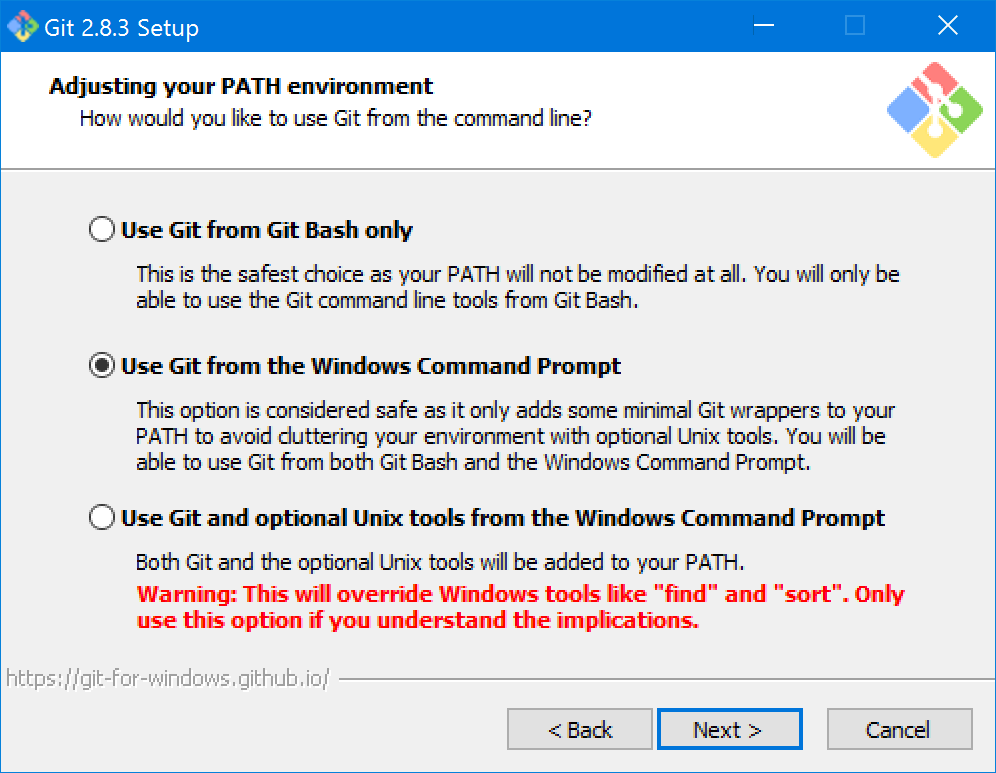

# Installing Git

The first step to learning Git is to get it installed! You have several options, depending on your computer's operating system.

Once you've got it installed, follow the instructions in **Getting Ready** at the bottom of this document.

## Windows

### GitHub Desktop

The easiest way to install Git on Windows is to install the latest version of [GitHub Desktop](https://desktop.github.com/). GitHub Desktop is a graphical Git client, but it also installs the underlying Git binary (and keeps it up to date).

Once you've installed GitHub Desktop, run the "Git Shell" program that comes with it. This is how you'll interact with Git via a command-line interface.

Jump down to **Getting Ready** and follow the rest of the instructions there!

### Official Download

You can also [download Git from the official web site](https://git-scm.com/downloads). During installation, you'll be asked how to adjust your PATH. If you choose "Use Git from Git Bash only," you'll need to use the Git Bash program that ships with Git to interact with Git.

If you choose "Use Git from the Windows Command Prompt," then you can also use Git from the command prompt and from PowerShell. In this case, the choice of whether to use Git Bash or a built-in Windows shell is up to you.

Once it's finished installing, jump down to **Getting Ready** and follow the rest of the instructions there!

## OS X

### Homebrew

If you use [Homebrew](http://brew.sh/), you can install Git using the following command:

    brew install git

### Official Download

You can also [download an installer for Git rom the official web site](https://git-scm.com/downloads).

Once you have Git installed, follow the instructions in **Getting Ready**, below.

# Getting Ready

Now that you've got Git installed, let's make sure you can access it, and that it's fully set up for you to use.

From your shell (Git Shell, Git Bash, or other terminal application of your choosing), type the following, replacing `YOUR NAME` with — you guessed it — your name.

    git config --global user.name "YOUR NAME"

You'll also want to set up your email address.

    git config --global user.email "YOUR EMAIL ADDRESS"

Assuming these commands run without errors, you're good to go! Otherwise, you may need to double-check your Git installation.
